# 15 Vanilla JS Projects

1. - [x] [Color Flipping](color_flipping) - [DEMO](https://color-flipping.netlify.app/)
2. - [x] [Plain Counter](plaincounter) - [DEMO](https://plaincounter.netlify.app/)
3. - [x] [Basic Reviews](reviews) - [DEMO](https://basicreviews.netlify.app/)
4. - [x] [Shrink Navbar](shrink_navbar) - [DEMO](https://shrinknavbar.netlify.app/)
5. - [x] [Sidebar Collapse](sidebar_collapse) - [DEMO](https://sidebarcollapse.netlify.app/)
6. - [x] [Basic Modal](basic_modal) - [DEMO](https://basicmodal.netlify.app/)
7. - [x] [Basic FAQ](basic_faq) - [DEMO](https://basicfaq.netlify.app/)
8. - [x] [Diner Menu](diner_menu) - [DEMO](https://dinermenu.netlify.app/)
9. - [x] [Dune Video](dune_video) - [DEMO](https://dunevideo.netlify.app/)
10. - [x] [Smooth Travels](smooth_travels) - [DEMO](https://smoothtravels.netlify.app/)
11. - [x] [About Tabs](about_tabs) - [DEMO](https://abouttabs.netlify.app/)
12. - [ ] [Countdown Timer](countdown_timer)
13. - [ ] [Lorem Ipsum](lorem_ipsum)
14. - [ ] [Grocery Bud](grocery_bud)
15. - [ ] [Slider](slider)

 

## Previews 🔍

	
Color Flipping 🟩

	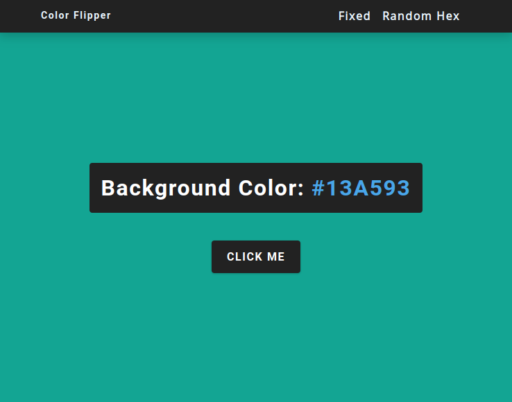

	
Plain Counter 🧮

	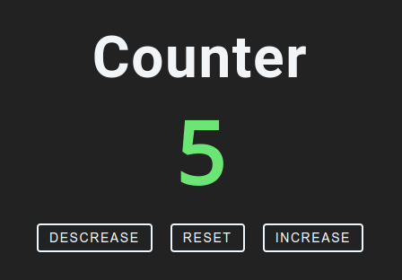

	
Basic Reviews ⭐

	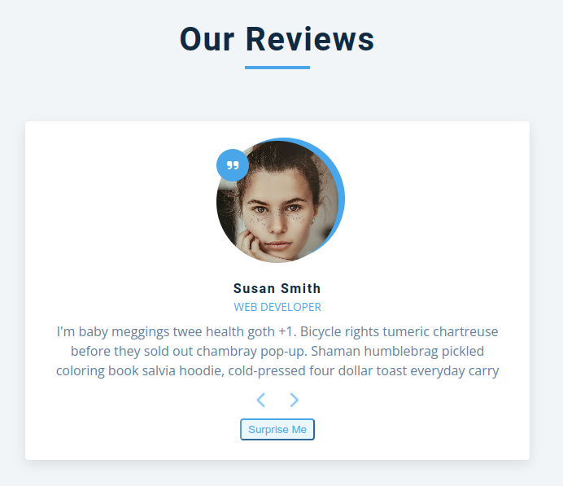

	
Shrink Navbar 🧭

	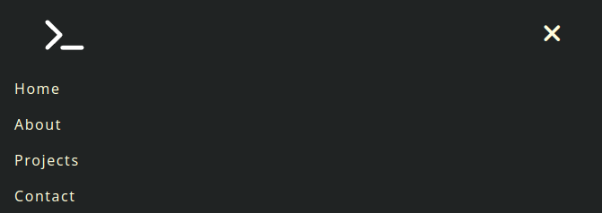

	
Sidebar Collapse ↔️

	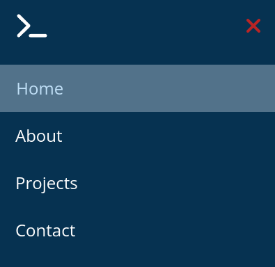

	
Simple Modal ❕

	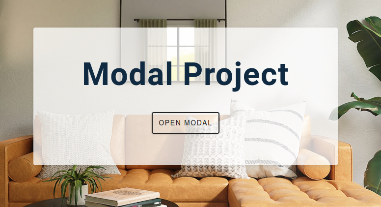

	
Basic FAQ ❔

	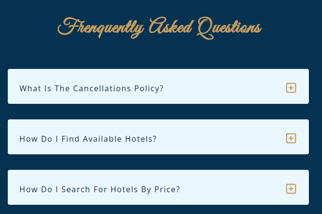

	
Diner Menu 🍴

	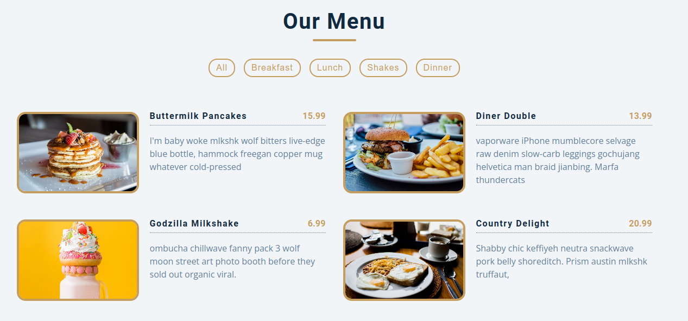

	
Dune Video ▶️

	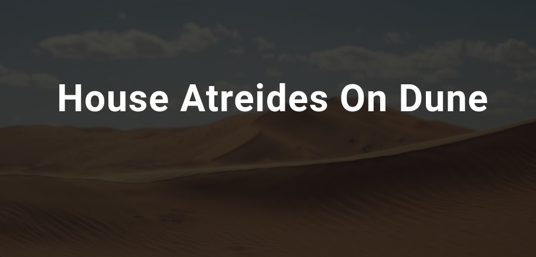

	
Smooth Travels 🗺️

	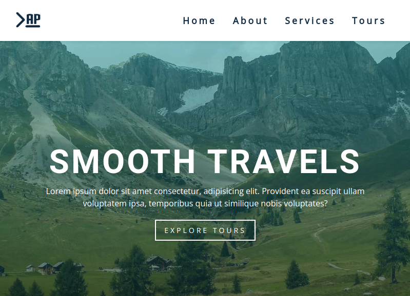

	
About Tabs 📑

	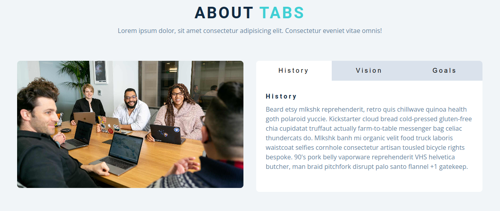

 
 

[*Original by John Smilga*](https://www.youtube.com/watch?v=3PHXvlpOkf4)

 

	<b>
		André Paulino
	</b>

